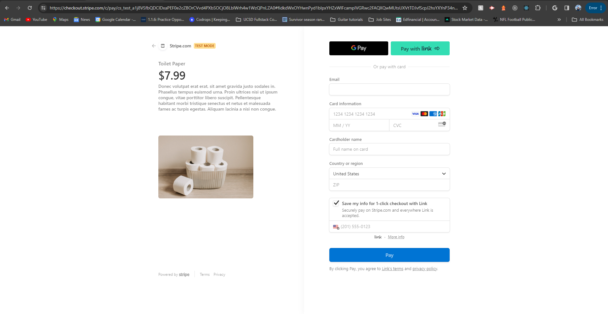
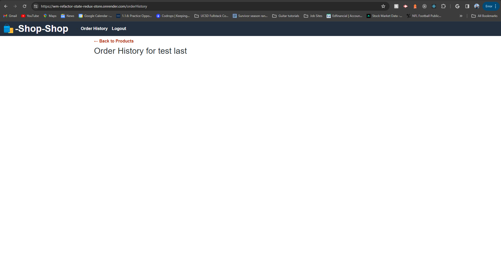
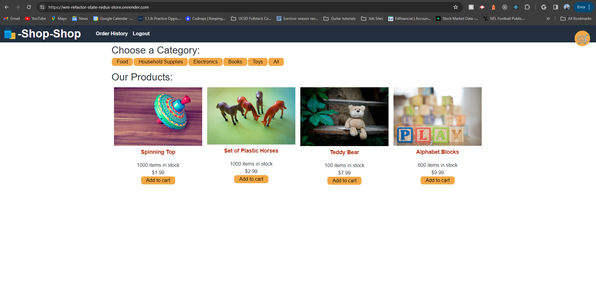

# WM-Refactor-State-Redux-Store

## Table of Contents
* [Description](#description)
* [Deployed Application](#deployed-application)
* [Screenshots](#screenshots)
* [Credits](#credits)
* [Questions](#questions)

## Description  
As a junior developer, I am sure I will have to frequently immerse myself in a new technology or framework with only the documentation (or lack thereof to help me). This application was an exercise in that skill as I am sure it will prove valuable in my career.

This application is a refactored e-commerce platform from [Activity 26](../01-Activities/26-Stu_Actions-Reducers/Unsolved) of the [UCSD-VIRT-FSF-PT-09-2023-U-LOLC GitLab repository](https://git.bootcampcontent.com/University-of-California---San-Diego/UCSD-VIRT-FSF-PT-09-2023-U-LOLC).

The application previously managed global state through the Context API and the end goal was to refactor it to use [Redux](https://redux.js.org/) to maintain the same functionality. The result of that effort can be found below.

## Deployed Application 
The deployed application is here: [https://wm-refactor-state-redux-store.onrender.com/](https://wm-refactor-state-redux-store.onrender.com/).

## Screenshots 

## Credits 
I had a tutoring session with Jacob Carver on 03/16/2024. Jacob helped me to understand where my code was going wrong in [https://github.com/wmason1997/WM-State-Redux-Store](https://github.com/wmason1997/WM-State-Redux-Store). I tried to correct my mistakes for a while longer there as you can see, but too much had been changed so I thought it best to reset the starter code in a different repository here and go through the steps we went over again. Thanks, Jacob!

I consulted XLA and ChatGPT to debug issues introduced in this refactoring exercise.

By 03/19, I had gotten the application refactored (I believe) and working locally, but I could not get it successfully deployed on Render, so I had another tutoring session with Jacob Carver and an AskBCS session with Joem Mervyll Casusi. Both were very helpful and their efforts resulted in the deployment above in this README. Thanks, Jacob and Joem!

## Questions 
Please feel free to reach out to me with questions/suggestions for this app or if you like to connect. 
My GitHub user name is wmason1997 and here is my profile: [https://github.com/wmason1997](https://github.com/wmason1997). 
My email is williamcmason1997@gmail.com.